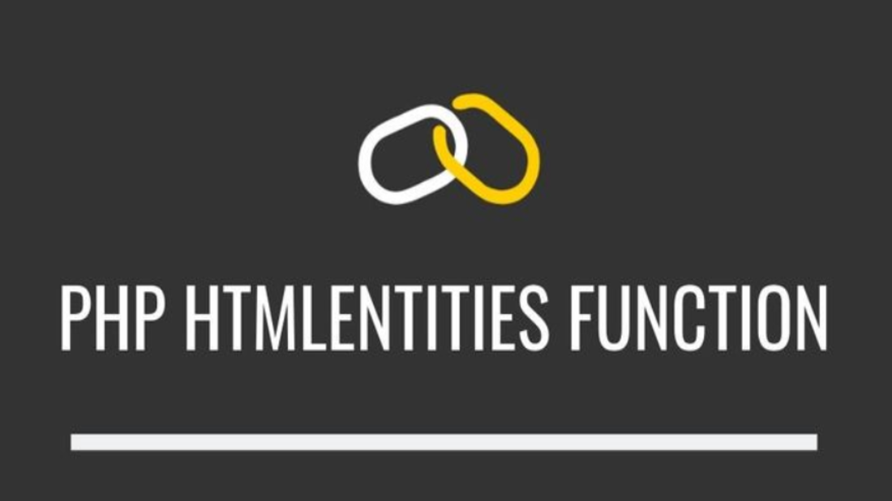
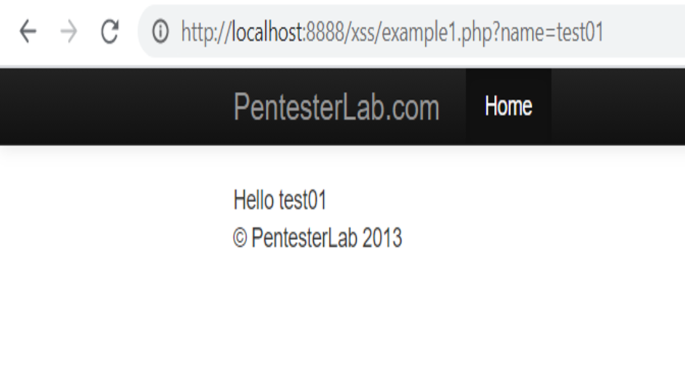
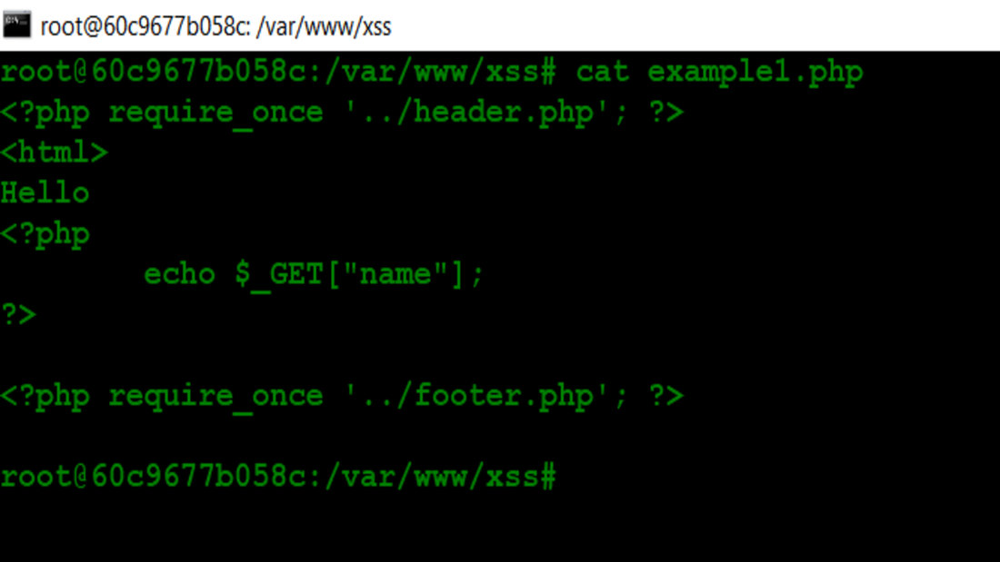
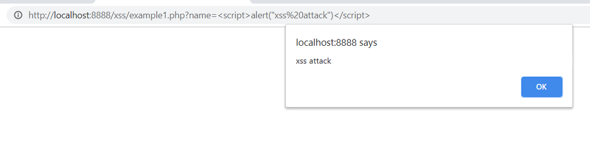
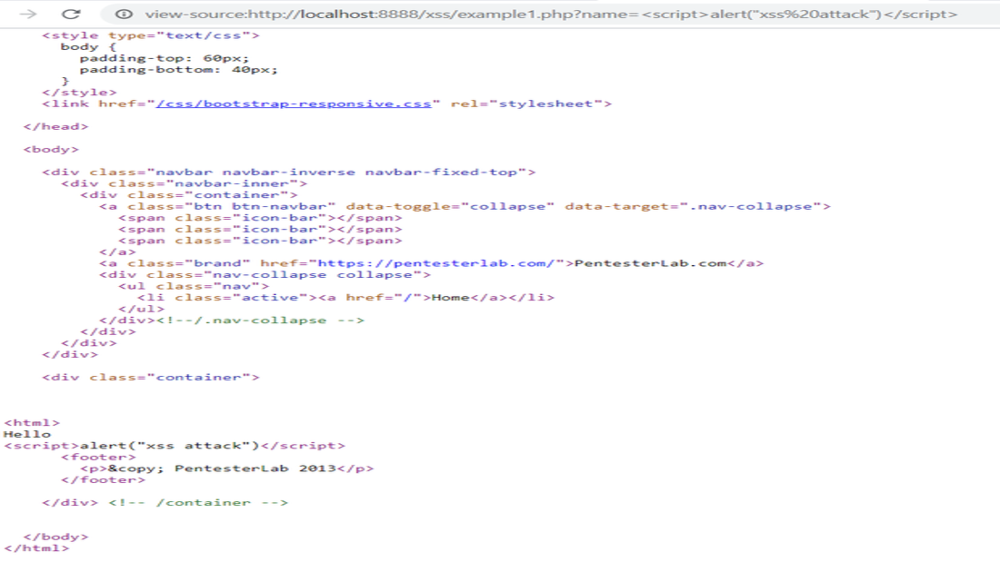
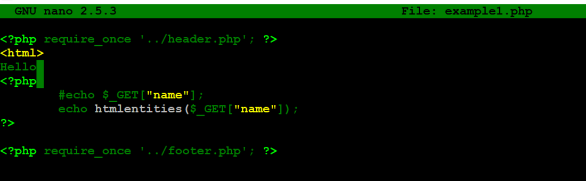
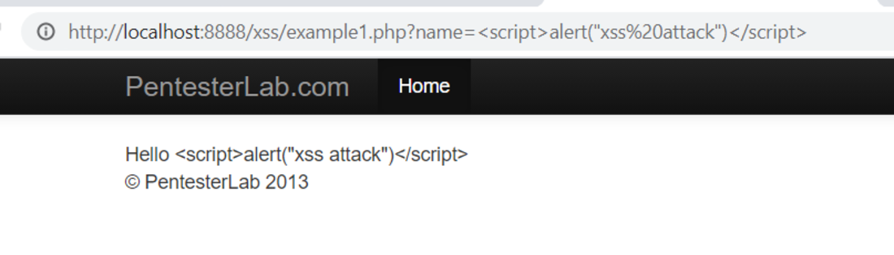
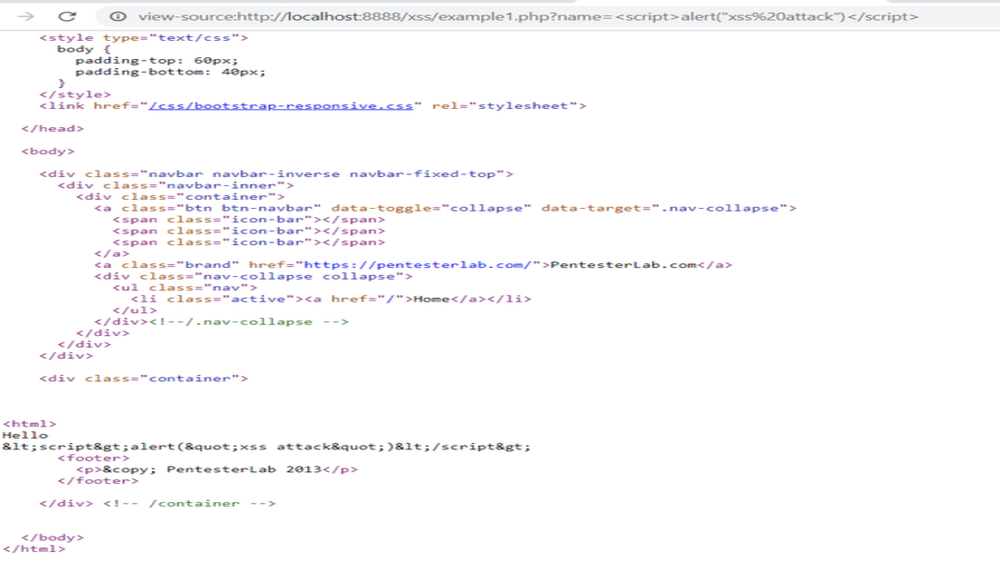

## PHP htmlentities() 
* **htmlentities()** เป็นฟังก์ชั่นซึ่งใช้ในการแปลงอักขระทั้งหมดที่ใช้กับเอนทิตี HTML และป้องกันการโจมตีจาก Cross-site Scripting (XSS) ไม่ให้เรียกใช้โค้ดและสคริปต์ html ที่อาจเป็นอันตราย ดังนั้น การที่ Web Application อนุญาตให้ ผู้ไม่หวังดีสามารถใส่คำสั่งบางอย่าง(java script) แล้ว Web Application นั้นได้มีการเรียกใช้คำสั่งดังกล่าวไปประมวลผล เมื่อมีเหยื่อมาเปิดเพจนั้น  Browser ของเหยื่อก็จะ execute java script  นั้นทันที ความรุนแรงขึ้นอยู่กับ java script ของผู้ที่เขียนขึ้นมา

### ตัวอย่าง
 ในหน้า page ของ web นี้จะอนุญาต ให้ ผู้ใช้งานสามารถส่ง ตัวแปร name ไปให้ server แล้ว server จะนำ ตัวแปรดังกล่าว มาแสดง เช่น หาก เราใส่ test01 เว็บก็จะแสดง ข้อความ hello +test01  บน website ให้ผู้ใช้งาน
 > 

 เมื่อเรา view source code จะพบว่า เว็บดังกล่าว มีการเขียน echo ตัวแปร name โดยไม่ได้มีการ html encode ก่อนและนำค่าตัวแปรดังกล่าวมาแสดง บน browser ผ่านการ echo ซึ่งทำให้อาจโดนโจมตีด้วยช่องโหว่ XSS ได้
>

ลองใส่ java script source code(script>alert(“xss attack”)</script) ให้ alert message ระบบจะแสดงข้อความดังกล่าวขึ้นมาทันที เพราะ server รับตัวแปร (java script ) ไปแสดงผลตรงๆ โดยไม่มีการทำ html encode  
ซึ่งหากเราส่ง URL ดังกล่าวไปคนอื่น(เหยื่อ)http://<ip>:port/xss/example1.php?name= script>alert(“xss attack”)</script เมื่อเหยื่อเปิด page ดังกล่าวก็จะเจอ ข้อความ alert ที่ได้ทำการเขียน java script ลงไป
>

เมื่อเรา  view source code จะเห็นว่า มีการแสดงตัวแปร name ที่ไปแสดงผลบน browser ไม่ได้มีการทำ html encode ส่งผลทำให้ browser นั้นตีความผิด มองค่าตัวแปร name ดังกล่าว เป็น java script เลยทำให้เกิดช่องโหว่ XSS
>

ซึ่งเราสามารถป้องกันการเกิดและลดโอกาสเกิดช่องโหว่นี้ โดยการใช้ function  htmlentities ก่อนแสดงผลให้ user เพื่อให้ browser เข้าใจว่า ส่วนที่แสดงผลเป็นแค่ข้อความ ไม่ใช่ java script  
แต่ htmlentities ไม่สามารถกัน XSS ได้ทุกกรณี เช่นหาก input ดังกล่าวไปตกลง ตรงบริเวณที่มีการเปิด tag  java script อยู่แล้ว แล้วผู้ไม่หวังดีสามารถเขียน java script ได้เลย ซึ่งนั้นอาจจะต้องใช้การ filter special string แทน 
>

หลังจากเราแก้ source code ให้ทำการ html encode ด้วย htmlentities ก่อนแสดงผล ให้ user  และลองทดสอบใส่ java script alert message อีกรอบ ระบบจะไม่แสดงข้อความอีก และ browser จะเห็นเป็นข้อความธรรมดา
>

เมื่อเรา  view source code จะเห็นว่ามีการ html encode ทำให้การโจมตี XSS ไม่เกิดขึ้น
>

-------------------------
##### Written by: PS