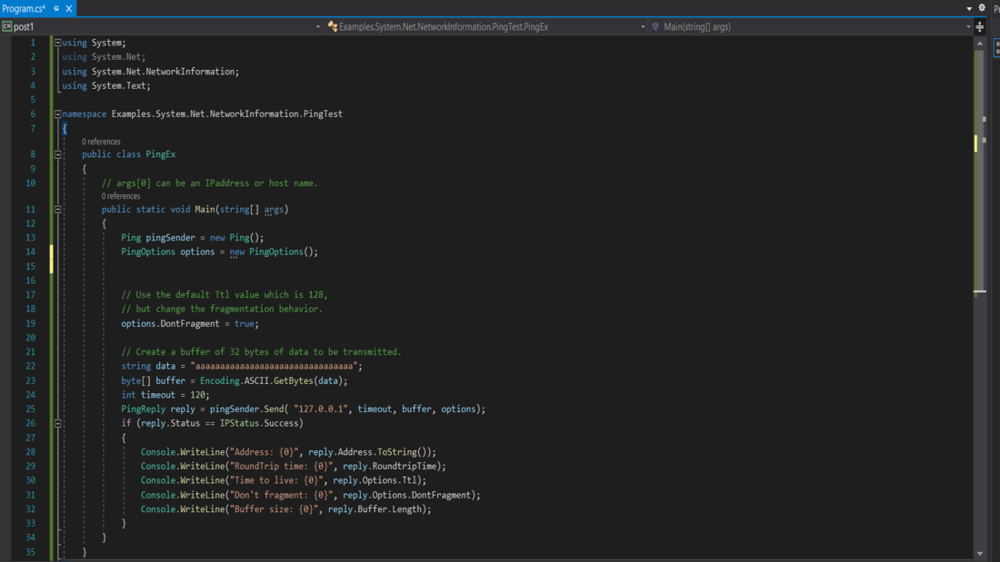
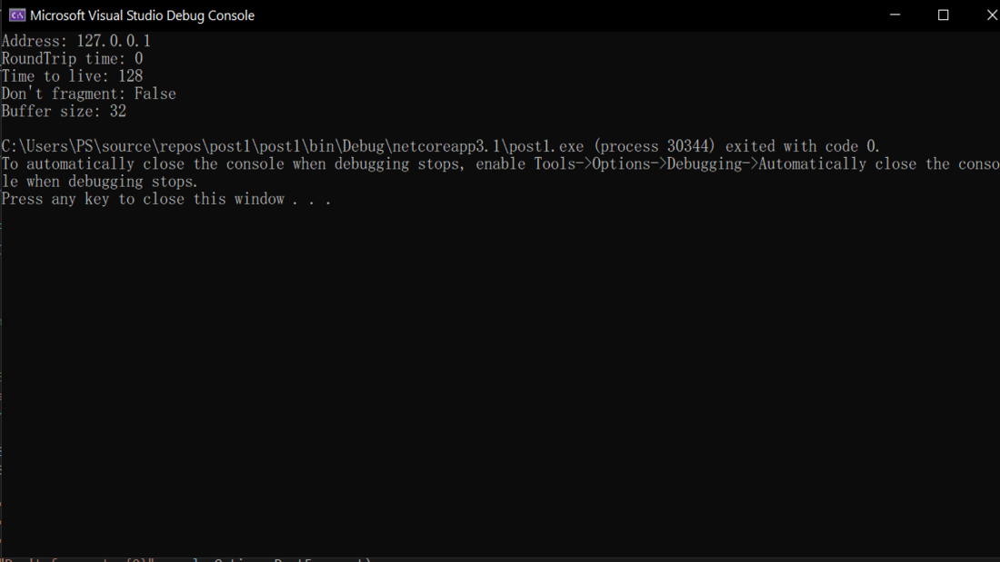

 

---------------------------

#### Ping Class
* **คำสั่ง ping** ใช้ในการทดสอบเส้นทางการสื่อสารระหว่างจากเครื่องที่ใช้อยู่ไปยังเครื่องคอมพิวเตอร์เครื่องอื่นในเครือข่าย ว่ามีการใช้งานอยู่หรือไม่ หรือทดสอบเว็บไซด์ว่าสามารถเข้าได้หรือไม่ โดยการพิมพ์ชื่อเครื่อง หรือ IP Address หรือชื่อเว็บไซด์ที่ต้องการตรวจสอบ

* ในบทความนี้ จะเป็นวิธีการ ping เครือข่ายและวิธีใช้ไลบรารี่ C# (System.Net.NetworkInformation)  เพื่อทดสอบความสามารถในการเข้าถึงของโฮสต์เครือข่าย ซึ่งการออกแบบยูทิลิตี้ ping เป็นสิ่งที่ช่วยให้ผู้ดูแลระบบเครือข่าย สามารถวินิจฉัยและแก้ไขปัญหาของเครือข่ายได้ ซึ่งจะมีผลในด้าน Availability ของเครือข่าย

* ในการตรวจสอบความพร้อมใช้งาน  ping จะส่ง การตั้งค่าเริ่มต้นแพ็คเก็ต ICMP echo request 4 แพ็คเก็ต ขนาด 32 ไบต์ ไปยังแอดเดรสที่กำหนดให้เป็นพารามิเตอร์ และ ping จะส่งชุดไบต์และเอาต์พุตแสดงข้อมูล รวมถึงที่อยู่ IP ของโฮสต์ลำดับ Internet Control Message Protocol(ICMP) Time To Live(TTL) และเวลาตอบสนองทั้งหมดในหน่วยมิลลิวินาที 

> **ในตัวอย่างนี้ จะเป็นการ ping เพื่อเช็คสถานะของเครื่องผู้เขียนที่ใช้งานอยู๋**

> **ผลลัพธ์**

* ***อย่างที่เราเห็นผลลัพธ์สามารถช่วยเราในการวินิจฉัยว่าโฮสต์เป้าหมายของเราทำงานอยู่และตอบสนองตามที่คาดไว้หรือไม่***

--------------------------------------

#### Reference
https://docs.microsoft.com/en-us/dotnet/api/system.net.networkinformation.ping?view=net-5.0