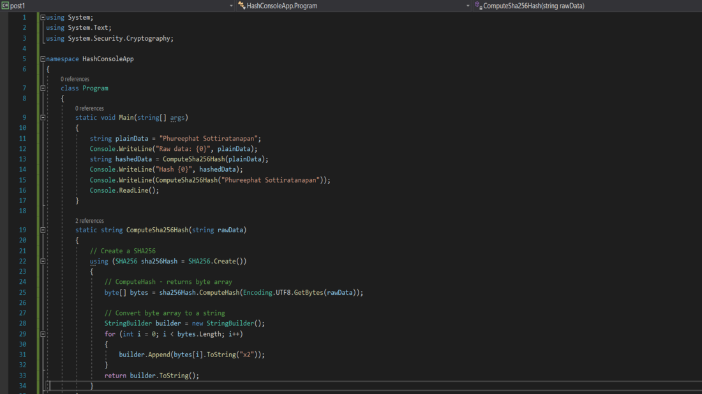

### SHA256Hash.ComputeHash()

--------------
**SHA256Hash.ComputeHash()**  เป็นการอัลกอริทึมแบบฟังก์ชั่นทิศทางเดียว ที่ถูกคิดค้นมาเพื่อนำมาใช้แทน SHA-1 ที่ปัจจุบันพบว่าไม่ปลอดภัยจากการโจมตีด้วย Preimage attack การทํางานของ SHA-256 จะใช้การบีบอัดข้อมูล โดยให้ผลลัพธ์ของการทํางานเป็นข้อความมีขนาดคงที่คือ 256 บิต ซึ่งโดยทั่วไปจะใช้ในการป้องกันกับข้อมูล เช่น รหัสผ่าน และลายเซ็นดิจิทัล เช่น การลงนามเอกสาร, การลงรหัส หรือ S/MIME อีเมล เพื่อให้มั่นใจว่าข้อมูลที่ส่งผ่านเครือข่ายนั้น ไม่มีการเปลี่ยนแปลงเนื่องจากข้อผิดพลาดของเครือข่ายหรือการถูกแทรกแซงจากมัลแวร์ ด้วยวิธีต่างๆ

> **จากรูปนี้ จะเป็นตัวอย่างของการเปลี่ยนรูปแบบข้อความโดยผ่านอัลกอริทึม SHA-256**  

> **ผลลัพธ์**

-------

#### Reference
https://docs.microsoft.com/en-us/dotnet/api/system.security.cryptography.sha256?view=netframework-4.8