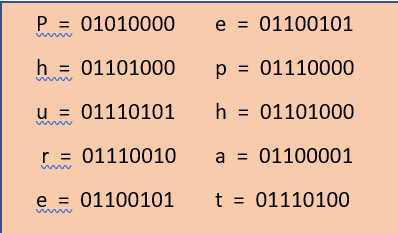
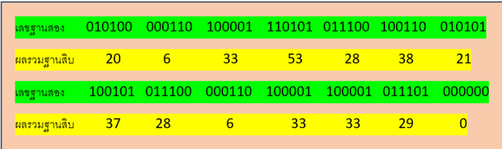
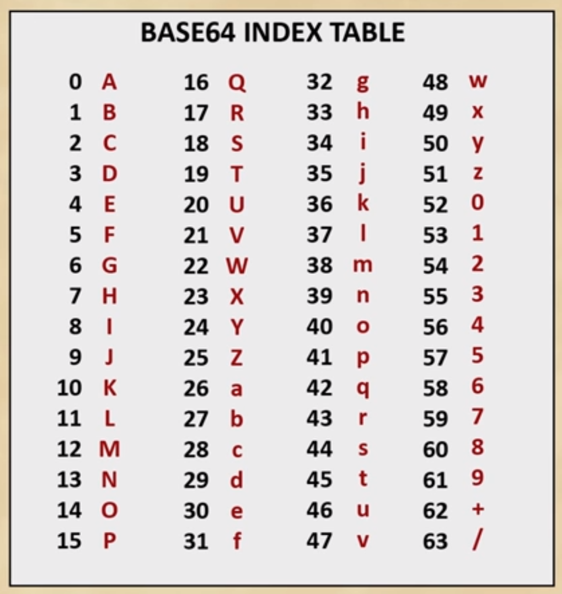
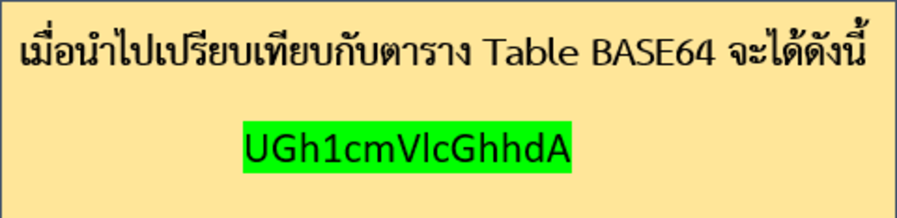
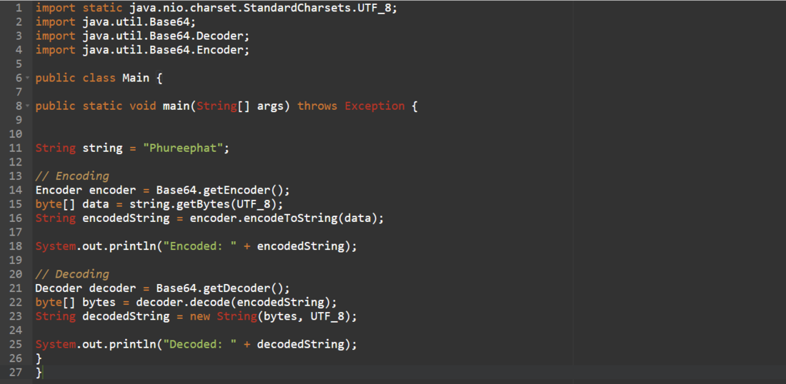
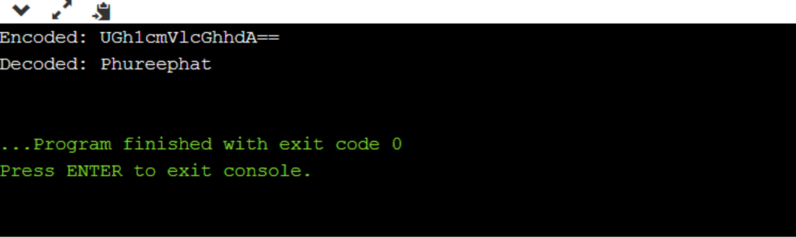

### java.util.Base64

--------------
* **Base64()** เป็นรูปแบบการแปลงไบนารี่เป็นข้อความ โดยรูปแบบข้อมูลจะประกอบไปด้วย a-z, A-Z, 0–9, + และ / ซึ่งจะมี 64 ตัวอักษรพอดี เราจะต้องทำการแปลงข้อมูลเป็น Byte ก่อนโดยการ Map แต่ละตัวอักษรกับตาราง ASCII (1 Byte จะมี 8 Bits) แล้วนำ Bits ที่ได้ทั้งหมดมาเรียงต่อก่อน และทำการแบ่งทีละ 6 bits เพื่อ Map ตามตารางของ Base64 เท่านี้ก็จะสามารถ Encode ข้อมูลแบบ Base64 ได้แล้ว 
* ส่วนการ decode เพียงแค่ทำการ Map ตัวอักษรกับตารางของ Base64 และ แปลงข้อมูลเป็นเลขฐานสอง จากนั้นนำมาเรียงใหม่จาก 6 Bits เป็น 8 Bits และ นำไปเทียบกับตาราง ASCII เท่านี้ก็สามารถแปลงข้อมูลกลับมาเป็นข้อความปกติได้แล้ว
* Base64 อาจนำมาใช้ในการยืนยันข้อความ (Message Authentication) ที่ถูกส่งผ่านระหว่างเครือข่าย ว่าข้อความที่ส่งไปน้ัน มีการถูกเปลี่ยนแปลงแก้ไขหรือไม่ หรืออีกด้านหนึ่ง ทางฝั่งผู้โจมตีอาจนำเอา Base64 มาใช้ในการโจมตีแบบ Cross-site Scripting ก็ได้เช่นกัน 

#### วิธีการแปลงข้อความด้วยอัลกอริทึม BASE64 ด้วยตัวอย่างคำว่า "Phureephat"

1.นําข้อมูลที่ต้องการมาแปลงเป็นเลขฐานสอง 8 bit 

2.เรียงบิตใหม่ แบ่งเลขฐานสองออกเป็นชุด ชุดละ 6 bit และนำเลขฐานสองไปคำนวณเป็นเลขฐานสิบ

3.นำผลที่คำนวณได้ไปเทียบกับตาราง Base64 Table
>

**สำหรับการ decode นั้น ให้ทําย้อนกลับโดยนําข้อมูลมาแปลงเป็นฐานสอง 6 bit มาเรียงต่อกัน แล้วนํามาจัดกลุ่ม กลุ่มละ 8 bit โดย bit สุดท้ายที่เหลือไม่ครบ 8 bit ให้ตัดทิ้ง หลังจากนั้นก็แปลงเลขฐานสอง 8 bit แต่ละชุดเป็นข้อมูล ASCII เท่านี้ก็จะได้ข้อมูลต้นฉบับแล้ว**

-------------

>**ตัวอย่างต่อไป เป็นการนำข้อความ "Phureephat" มา encode และ decode  ผ่านอัลกอริทึมแบบ Base64 ด้วย java**
  

> **ผลลัพธ์**

-------------------------
##### Written by: PS

#### Reference
https://www.infoworld.com/article/3240006/base64-encoding-and-decoding-in-java-8.html

