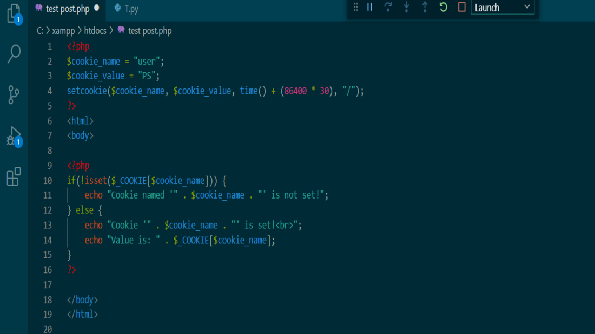
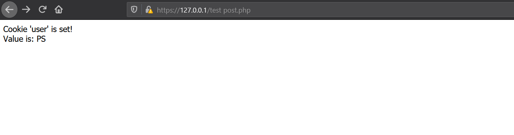

## PHP setcookie()
*  **setcookie()** เป็นการกำหนดค่าของคุกกี้ที่จะส่งไปพร้อมกับ HTTP Header เราจะใช้คุกกี้เพื่อระบุตัวของผู้ใช้ และสามารถจัดเก็บข้อมูลบางอย่างไว้ที่เว็บเบราว์เซอร์ของผู้ใช้งาน แต่คุกกี้นั้นอาจส่งผลเสียได้ในเรื่องของข้อมูลส่วนตัวของคุณอาจถูกลักลอบส่งกลับไปยังเว็บไซต์ไม่พึงประสงค์ จนนำไปสู่การถูกแฮกข้อมูลบัญชีใช้งาน โดยเฉพาะอย่างยิ่งข้อมูลเกี่ยวกับการทำธุรกรรมออนไลน์ คุกกี้คือไฟล์ขนาดเล็กที่เซิร์ฟเวอร์ฝังไว้ในคอมพิวเตอร์ของผู้ใช้ ทุกครั้งที่คอมพิวเตอร์เครื่องเดียวกันร้องขอหน้าเว็บด้วยเบราว์เซอร์ คอมพิวเตอร์จะส่งคุกกี้ไปด้วย เราสามารถสร้างและดึงค่าคุกกี้ได้ ซึ่งชื่อของคุกกี้จะถูกกำหนดให้กับตัวแปรที่มีชื่อเดียวกันโดยอัตโนมัติ เช่นหากส่งคุกกี้โดยใช้ชื่อ "user" ตัวแปรจะถูกสร้างขึ้นโดยอัตโนมัติชื่อว่า $ user 

### Syntax
> **setcookie(name, value, expire, path, domain, secure, httponly);**

### Parameter Values
|Parameter|Description|
|--------|---------|
|name|ชื่อของคุกกี้|
|value|ค่าของคุกกี้|
|expire|ระบุให้คุกกี้หมดอายุ เช่น 86400 * 30 จะกำหนดให้คุกกี้หมดอายุใน 30 วัน หากไม่ใส่พารามิเตอร์นี้ คุกกี้จะหมดอายุเมื่อสิ้นสุดเซสชัน 
|path|ระบุเส้นทางเซิร์ฟเวอร์ของคุกกี้ ถ้ากำหนด "/" คุกกี้จะพร้อมใช้งานภายในโดเมนทั้งหมด หากกำหนดเป็น "/ php /" คุกกี้จะใช้ได้เฉพาะในไดเร็กทอรี php และไดเร็กทอรีย่อยทั้งหมดของ php 
|domain|ระบุชื่อโดเมนของคุกกี้|
|secure|กำหนดว่าควรส่งคุกกี้ผ่านการเชื่อมต่อ HTTPS ที่ปลอดภัยหรือไม่ |
|httponly|สามารถตั้งค่ากำหนดให้คุกกี้เข้าถึงได้ผ่านโปรโตคอล HTTP เท่านั้น (คุกกี้จะไม่สามารถเข้าถึงได้ด้วยภาษาสคริปต์) การตั้งค่านี้สามารถช่วยลดการขโมยข้อมูลผ่านการโจมตี XSS|

### ตัวอย่าง
ทำการสร้างคุกกี้ชื่อ "user" ด้วยค่า "PS" คุกกี้จะหมดอายุหลังจาก 30 วัน (86400 * 30) "/" หมายความว่าคุกกี้มีอยู่ภายในโดเมนทั้งหมด  จากนั้นเราจะดึงค่าของคุกกี้ "user" ด้วย $ _COOKIE และใช้ isset() เพื่อดูว่าคุกกี้ถูกตั้งค่าไว้หรือไม่

> 

### ผลลัพธ์

> 

การกำหนดเวลาของคุกกี้ จะขึ้นอยู่กับการกำหนดค่าของผู้สร้าง และส่งผลต่อความปลอดภัยได้

-------------------------

#### Reference
https://codebridgeplus.com/php-5-cookies/

https://www.w3schools.com/php/func_network_setcookie.asp
