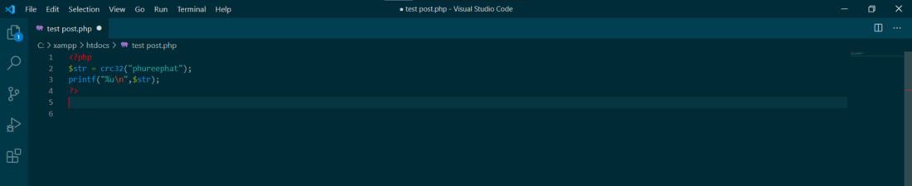
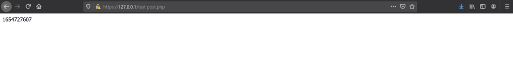

### PHP crc32() 
* **Cyclic Redundancy Check:(CRC)** เป็นวิธีการตรวจสอบที่ได้รับความนิยมในการใช้
งานสําหรับการรับ-ส่ง ข้อมูลแบบเข้าจังหวะ(Synchronous)
* **ฟังก์ชัน crc32()** เป็นการนำเอาข้อความมาผ่านฟังก์ชั่น hash ด้วย algorithm cyclic redundancy checksum และจะคืนค่าเลขจำนวนเต็มแบบ polynomial ขนาด 32 บิต (การตรวจสอบความซ้ำซ้อนแบบวนรอบ)ฟังก์ชันนี้สามารถใช้เพื่อตรวจสอบความสมบูรณ์ของข้อมูล เนื่องจากในบางครั้งอาจเกิดการเปลี่ยนแปลงของข้อมูล หรือ เกิดความเสียหายต่อข้อมูล ดังนั้นการนำ crc32 มาใช้จะช่วยให้มั่นใจว่าข้อมูลนั้นมีความถูกต้อง ไม่ได้เกิดการเปลี่ยนแปลงใดๆ

**Parameter Values**

|Parameter|Description  |
|---------|-----------|
|String:|ข้อความตัวอักษรที่จะคำนวณ|  

**รูปแบบการใช้**
  >  crc32 ( string $string ) : int

เนื่องจากประเภทจำนวนเต็มของ PHP มีการลงนามในการตรวจสอบ crc32 จำนวนมากจะทำให้เกิดจำนวนเต็มลบ บนแพลตฟอร์ม 32 บิต ในการติดตั้ง 64 บิต ผลลัพธ์ของ crc32() ทั้งหมดจะเป็นจำนวนเต็มบวก ดังนั้นคุณต้องใช้ฟอร์แมตเตอร์ "% u" เพื่อรับการแสดงสตริงของการตรวจสอบ crc32() ที่ไม่ได้ลงชื่อในรูปแบบทศนิยม

-----------------------
>**ตัวอย่าง**   แสดงการตรวจสอบ crc32 ตัวอย่างนี้แสดงวิธีการพิมพ์ checksum ที่แปลงแล้วด้วยฟังก์ชัน printf ():

>ผลลัพธ์ ค่าของ String ที่ได้จะเป็น

-----------------------

#### Reference
https://www.php.net/manual/en/function.crc32.php

    

