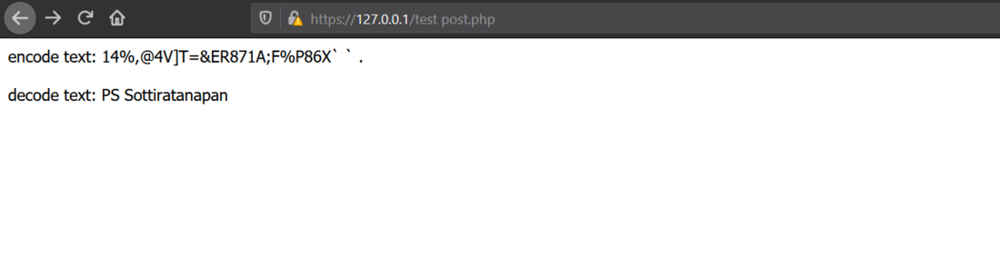

## convert_uuencode() & convert_uudecode()
---------------------
* **convert_uuencode()** เป็นการเปลี่ยนรูปแบบของข้อความให้เป็นรูปแบบไบนารี่ โดยผ่านอัลกอริทึม uuencode ข้อความที่ได้จะมีความปลอดภัยสำหรับการส่งผ่านเครือข่าย เพราะการโจมตีทางไซเบอร์ที่เกิดขึ้นในหลายๆครั้ง ทางผู้โจมตีอาจประสงค์ต่อข้อมูลที่ส่ง ไป-มา ระหว่างเครือข่ายนั้นเอง 
* **convert_uudecode()** ใช้ถอดข้อความที่ได้ผ่านอัลกอริทึม uuencode มาแล้ว ให้กลับมาเป็นข้อความที่เราสามารถอ่านได้อีกครั้ง

> **สำหรับตัวอย่างนี้ การเปลี่ยนรูปแบบข้อความ แบบ uuencode และแปลงข้อความที่ผ่าน uuencodec กลับมาด้วย uudecode**  

>**ผลลัพธ์ uuencode และ uudecode ของรูปด้านบน**

ซึ่งในปัจจุบันอัลกอริทึมแบบ uuencode และ uudecode อาจถูกแทนที่ด้วย MIME และ yEnc เป็นส่วนใหญ่ เมื่อใช้ MIME ไฟล์ที่อาจถูกเข้ารหัสจะถูกถ่ายโอนด้วยการเข้ารหัส base64 แทน

-----------------------------
##### Written by: PS